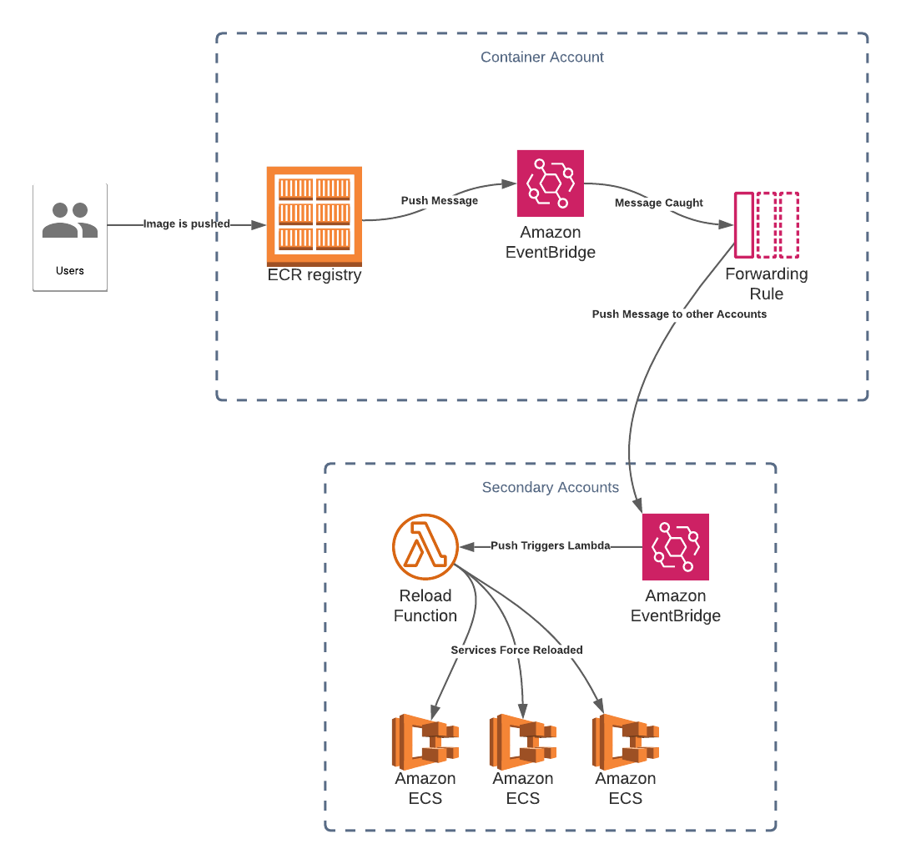

# Lambda ECS Redeploy

This Lambda force deploys ECS services when their images are updated in ECR, using Eventbridge as an intermediary to trigger the Lambda.


## Usage

### Tags

This function will skip any services or lambdas that do not have the `AutoDeploy` tag set to `true`.

Additionally Lambda functions need to have an `Image` tag with the URI of the image they're based off of, as AWS does not allow that information to be retrieved via their API.


### Eventbridge

The best way to run this in production is to point an Eventbridge Rule that triggers this Lambda when an ECR Image is deployed. If the Registry is in another account then a forwarding rule will need to be created for each account to be triggered.




### CLI

For testing purposes the script can be called directly-

```bash
python app.py image-to-reload
```

This will cause all Services and Lambdas using the image
